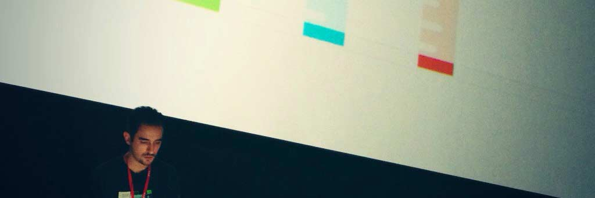

I'm Ed, a web enthusiast, speaker, writer, design admirer, and Developer Advocate for Progress. I have designed and developed web based applications for business, manufacturing, systems integration as well as customer facing websites. I enjoy geeking out to cool new tech, brainstorming about future technology, and admiring great design.

  

I frequently travel the eastern states of the U.S. speaking at conferences. You'll find me talking about ASP.NET MVC, responsive web design, UX, and clean coding practices. In 2016 became a Microsoft MVP for Visual Studio and Tools.

The contents of this site are thoughts of my own and do not represent my employer.

### Contact

Want to ask a general question? Use my [GitHub AMA](//github.com/edcharbeneau/ama) for that!

I most likely will not respond to individual code queries due to the volume and time constraints, please defer to StackOverflow (sorry)!

[Tweeting me](//twitter.com/edcharbeneau) is the fastest way to get hold of me.

### Licensing

All code you see here is free to use however you see fit, however corresponding GitHub projects articles may mention usually have an MIT license.
