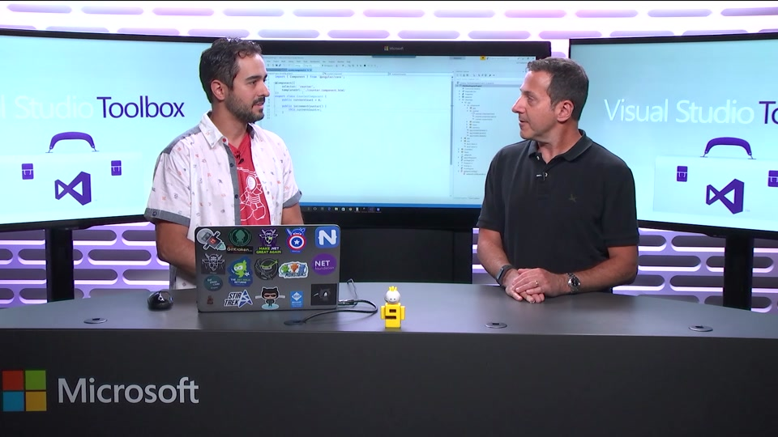

Ed is a Microsoft MVP and an international speaker, writer, online influencer, a Developer Advocate for Progress, and expert on all things web development. Ed enjoys geeking out to cool new tech, brainstorming about future technology, and admiring great design.

Ed has shared his insights, experiences, and advice around collaboration, knowledge management, social computing, and training at many industry events around the United States. Highly ethical and engaging with an uncanny business acumen, he is a creative community builder and outside the box thinker. Long term business relationships throughout the world within internal communications, employee engagement and marketing as well as IT. Focusing on Financial, Healthcare, Manufacturing, Agency and Professional Services. He has defined, architected, implemented line of business solutions with a touch of style and UX best practices.

  

Specialties: Ability to learn, master and communicate new technologies, Visual Studio, C#, JavaScript, .NET, Angular, Entity Framework, user experience design (UX), responsive web design, clean coding practices, social networking and media, collaboration, Twitter and Facebook.

I frequently travel the eastern states of the U.S. speaking at conferences. You'll find me talking about ASP.NET MVC, . In 2016 became a Microsoft MVP for Visual Studio and Tools.

The contents of this site are thoughts of my own and do not represent my employer.

### Contact

Want to ask a general question? [Tweeting me @edcharbeneau](//twitter.com/edcharbeneau) is the fastest way to get hold of me.

If you're a recuriter and would like to send me a job offers, please submit them via LinkedIn so I can ignore them in bulk.

### Licensing

All code you see here is free to use however you see fit, however corresponding GitHub projects articles may mention usually have an MIT license.
